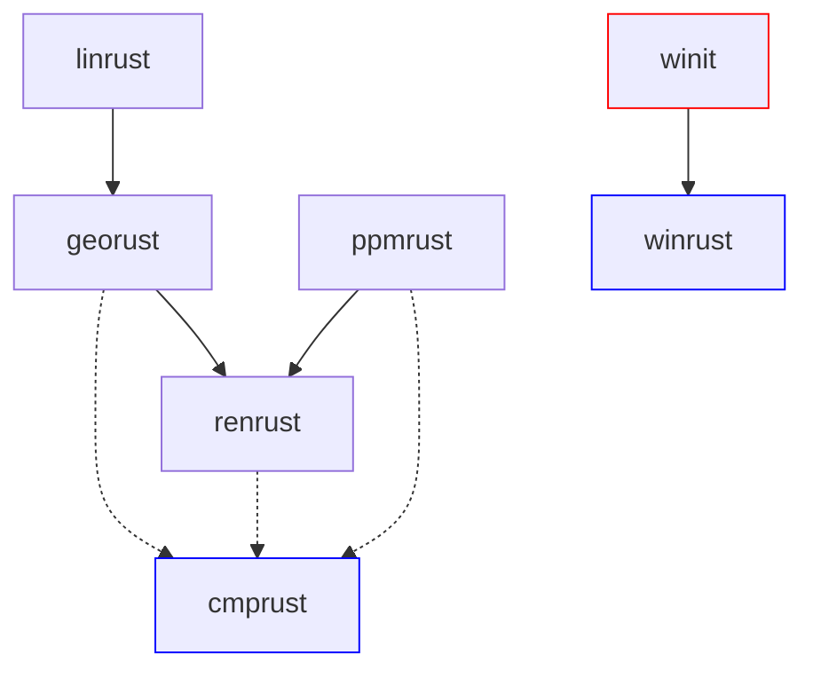

# computer_graphics

## Description

Computer graphics in Rust.

It's a workspace with different crates.

### Binary crates (blue)

- `cmprust`
    - Main program (draw PPM).

- `winrust`
    - Main program (open window).

### Library crates (white)

- `georust`
    - Provides types and methods for geometric concepts.

- `linrust`
    - Provides types and methods for computer graphics.

- `ppmrust`
    - Provides types and methods for PPM images.

- `renrust`
    - Provides methods for rendering.

### External crate (red)

- `winit`
    - Cross-platform window creation and event loop management library.

## Dependencies



## Commands

### Version

```bash
% rustc --version
# rustc 1.92.0 (ded5c06cf 2025-12-08)

% cargo --version
# cargo 1.92.0 (344c4567c 2025-10-21)
```

### Utils

```bash
% cargo build # Compile every crate
% cargo test # Test every crate

% cargo run -p cmprust # Run crate binary
% cargo test -p [name] # Test crate library
```

## Results

- `cmprust`


- `winrust`

